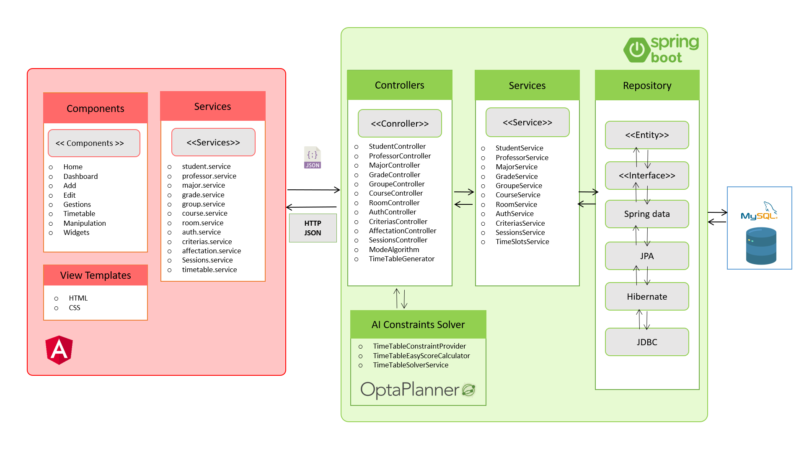

# SmartBendEd_Plateform project


This article describes our framework of blended learning that aims at developing a user-friendly platform designed to improve the accessibility and organization of learning. Centered around the needs of students and teachers, the platform aims to simplify scheduling, customize timetables, and boost
engagement. By enabling students and teachers to share preferences and constraints, it aims to transform our approach to education. This initiative aims to not only make learning more efficient but also meet the unique needs of each student’s learning journey.

## Table of Contents

- [Overview](#overview)
- [Software architecture](#Software-architecture)
- [Frontend](#frontend)
- [Backend](#backend)
- [Getting Started](#getting-started)
- [Usage](#usage)
- [Folder Structure](#folder-structure)
- [Dependencies](#dependencies)
- [Contributing](#contributing)
- [License](#license)

## Overview

The project aims to create a user-friendly blended learning platform that prioritizes efficient scheduling and planning. It seeks to empower both teachers and students by considering their constraints and preferences. This platform will not only optimize resource allocation but also enhance student engagement through adaptable learning schedules. It aspires to provide educators with tools to input their constraints and teaching modes while offering realtime updates and data-driven insights for administrators. Ultimately, the project’s goal is to improve learning outcomes by making blended learning a more organized, accessible, and effective educational approach.

## Software architecture

The software architecture employs a decoupled approach, leveraging Spring Boot for the backend infrastructure that includes a set of dedicated controllers such as StudentController, ProfessorController, MajorController, and others, each managing HTTP requests and serving as the intermediary between the Angular frontend and the MySql database. Angular, the frontend framework, encompasses components like Add, Dashboard, Edit, Gestions, Home, Timetable, and Widgets, driving user interface interactions and sending HTTP requests to Spring Boot. Accompanying these components are numerous services like student.service, professor.service, major.service, and others in Angular, each corresponding to Spring Boot services responsible for handling business logic and operations for entities like students, professors, majors, and more. These services interact with respective repositories— StudentRepository, ProfessorRepository, MajorRepository—providing an abstraction layer for database operations. This architecture ensures efficient communication between frontend and backend, enabling scalable development and deployment while maintaining a clear separation of concerns and facilitating the management and expansion of the web application’s functionalities.

## Frontend

### Technologies Used

- Angular
- Bootstrap

## Frontend Project Structure

The Angular front-end project is organized around six main components, each serving a specific purpose and contributing to the overall architecture and maintainability of the application.

### 1. ADD Component

- **Purpose:** The ADD component is responsible for handling the addition of new items, entities, or data to the application.
- **Functionality:** Users can input relevant information and submit data, triggering actions such as creating new records or entities.

### 2. GESTION Component

- **Purpose:** The GETSION component focuses on retrieving and displaying data from the backend server.
- **Functionality:** It fetches and presents information, enabling users to view details or perform actions related to the retrieved data.

### 3. DASHBOARD Component

- **Purpose:** The DASHBOARD component serves as the central hub for users, offering an overview of key metrics, statistics, or important information.
- **Functionality:** It may aggregate data from various sources and present it in a visually appealing and informative manner.

### 4. EDIT Component

- **Purpose:** The EDIT component handles the modification of existing data or entities.
- **Functionality:** Users can access and edit information, with changes reflected in real-time or upon submission.

### 5. HOME Component

- **Purpose:** The HOME component acts as the main entry point of the application, providing a landing page or initial interface.
- **Functionality:** It may include navigation links, welcome messages, or any other content to guide users through the application.

### 6. TIMETABLE Component

- **Purpose:** The TIMETABLE component is responsible for displaying schedules, calendars, or timelines within the application.
- **Functionality:** Users can view and manage time-based information, making it particularly relevant for applications with scheduling features.

### Shared Components and Services

- **Shared Components:** Identify any components that are reused across multiple parts of the application, promoting code reusability.
- **Services:** Mention any Angular services used for common functionality, data retrieval, or interaction with the backend.

### Routing

- **Angular Router:** Describe how the Angular Router is utilized to navigate between the different components, ensuring a seamless user experience.

### Styling and Theming

- **Styling:** Specify the styling approach, whether it's through plain CSS, SCSS, or the use of a specific CSS framework.
- **Theming:** If applicable, describe how theming is handled in the application.

### Dependencies

List the main dependencies for the frontend along with their versions.

```json
{
  "dependencies": {
    "@angular/animations": "^16.0.0",
    "@angular/cdk": "^17.0.1",
  },
  "devDependencies": {
    "@angular-devkit/build-angular": "^16.0.1",
    "@angular/cli": "~16.0.1",
  }
}
```

## Backend

### Technologies Used

- Spring Boot
- MySQL

## Backend Project Structure

The backend code follows a modular and organized structure, leveraging the power of Spring Boot for building a robust and scalable application.

### 1. `com.example.application`

- **Main Application Class:** `Application.java` serves as the entry point for the Spring Boot application. It includes the `main` method to start the application.

### 2. `com.example.controller`

- **Controller Classes:** The `controller` package contains classes responsible for handling incoming HTTP requests. Each controller class is dedicated to a specific feature or entity, exposing RESTful endpoints. These classes interact with the services to process requests and return appropriate responses.

### 3. `com.example.service`

- **Service Classes:** The `service` package hosts classes that encapsulate business logic. These classes are used by controllers to perform operations on data and communicate with repositories. They provide a layer of abstraction between controllers and repositories.

### 4. `com.example.model`

- **Entity Classes:** The `model` package includes classes representing data entities in the application. These classes are annotated with JPA annotations, defining the structure of the database tables. Each entity typically corresponds to a table in the MySQL database.

### 5. `com.example.repository`

- **Repository Interfaces:** The `repository` package contains interfaces that extend Spring Data JPA repositories. These interfaces provide methods for basic CRUD operations and are used by services to interact with the database.


### Dependencies

1. **Spring Data JPA:**
   - Purpose: Simplifies data access using JPA in Spring Boot.

2. **Lombok (Optional):**
   - Purpose: Reduces boilerplate code by generating methods during compilation.

3. **MySQL Connector/J:**
   - Purpose: JDBC driver for connecting to a MySQL database.

4. **OptaPlanner:**
    - Purpose: OptaPlanner is an AI constraint satisfaction solver that is used for automated planning and optimization. It provides optimization algorithms to solve complex planning problems, making it suitable for scenarios like resource allocation, scheduling, and more in your blended learning platform.
```xml
        <dependency>
            <groupId>org.optaplanner</groupId>
            <artifactId>optaplanner-core</artifactId>
        </dependency>
        <dependency>
            <groupId>org.optaplanner</groupId>
            <artifactId>optaplanner-test</artifactId>
            <scope>test</scope>
        </dependency>
```

## Getting Started

Certainly! Here are step-by-step instructions to set up and run your project locally:

### Prerequisites:

1. **Git:**
   - Make sure you have Git installed. If not, download and install it from [git-scm.com](https://git-scm.com/).

2. **XAMPP:**
   - Install XAMPP from [apachefriends.org](https://www.apachefriends.org/).
   - Start the Apache and MySQL servers in XAMPP.
   - Ensure MySQL is using port 3306.

3. **Node Version Manager (NVM):**
   - Install NVM from [github.com/nvm-sh/nvm](https://github.com/nvm-sh/nvm).
   - Use NVM to install Node.js version 14.11.0: `nvm install 14.11.0`.

### Backend Setup:

1. **Clone the Project:**
   ```bash
   git clone <repository_url>
   cd <project_folder>
   ```

2. **Install Backend Dependencies:**
   - Open a terminal in the backend project folder.
   - Run the following commands:
     ```bash
     mvn clean install
     ```

3. **Run Backend:**
   - Start your XAMPP Apache and MySQL servers.
   - Run the Spring Boot application. The database and entities will be created automatically.
   - Verify that the backend is running by visiting [http://localhost:8082](http://localhost:8082) in your browser.

### Frontend Setup:

1. **Install Node.js and Angular:**
   - Open a new terminal for the frontend project.
   - Ensure NVM is using Node.js version 14.11.0: `nvm use 14.11.0`.
   - Install Angular CLI globally: `npm install -g @angular/cli`.

2. **Install Frontend Dependencies:**
   - Run the following commands in the frontend project folder:
     ```bash
     npm install
     ```

   - If you encounter errors during installation, use the following command:
     ```bash
     npm install --save --legacy-peer-deps
     ```

3. **Run Frontend:**
   - After installing dependencies, start the Angular development server:
     ```bash
     ng serve
     ```

   - Access the frontend at [http://localhost:4200](http://localhost:4200) in your browser.

Now, your full-stack project should be up and running locally. If you encounter any issues during setup, check the console logs for error messages and ensure that all dependencies and prerequisites are correctly installed.

# Illustrative example
Interface (Admin) for different managements

A proposed scheduling program learning for a student


# Contributing

We welcome contributions from everyone, and we appreciate your help to make this project even better! If you would like to contribute, please follow these guidelines:

## Contributors

- Reda Makaoui ([GitHub]([https://github.com/redamakaoui](https://github.com/rmakaoui)))
- Refki Elhadi ([GitHub]([https://github.com/refkielhadi](https://github.com/edwinref)https://github.com/edwinref))
- Oussama Ouhayou ([GitHub]([https://github.com/oussamaouhayou](https://github.com/OUSSAMAOUHA)))
